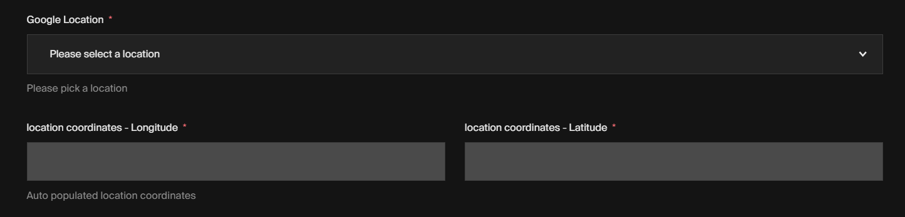

# Google Maps Autocomplete plugin

> **Note**
> This plugin is currently under active development and still in an early stage.
> Check the [roadmap](#roadmap) below in this readme for more details / upcoming features.

<!-- <picture>
  <source media="(prefers-color-scheme: dark)" src="./preview-dark.png" />
  <source media="(prefers-color-scheme: light)" src="./preview-light.png" />
  
</picture> -->

## Installation

The most recent version of payload-google-autocomplete-places currently only supports Payload 2.0 and up.

```shell
$ yarn add payload-google-autocomplete-places
$ npm i payload-google-autocomplete-places
```

## Basic usage

```typescript
import { CollectionConfig } from "payload/types";
import { googleMapAutoCompletePlaces } from "payload-google-autocomplete-places";

const Examples: CollectionConfig = {
  slug: "examples",
  admin: {
    useAsTitle: "title",
  },
  fields: [
    {
      name: "title",
      type: "text",
    },
    ...googleMapAutoCompletePlaces({
      apiKey: "", //<google maps API Key Goes Here>
      name: "google_location",
      label: "Google Location",
    }),
  ],
};
```

## Detailed usage (with all props)

```typescript
import { CollectionConfig } from "payload/types";
import { googleMapAutoCompletePlaces } from "payload-google-autocomplete-places";

const Examples: CollectionConfig = {
  slug: "examples",
  admin: {
    useAsTitle: "title",
  },
  fields: [
    {
      name: "title",
      type: "text",
    },
    ...googleMapAutoCompletePlaces({
      apiKey: "", //<google maps API Key Goes Here>
      name: "google_location",
      label: "Google Location",
      required: true,
      minLengthAutocomplete: 3,
      autocompletionRequest: {
        bounds: [
          { lat: 50, lng: 50 },
          { lat: 100, lng: 100 },
        ],
        componentRestrictions: {
          country: ["us", "ca", "uy"],
        },
      }, //Note: for more information check google documentation(https://developers.google.com/maps/documentation/javascript/reference/places-autocomplete-service#AutocompletionRequest).

      debounce: 400,
      apiOptions: { language: "fr", region: "fr" }, //Note: for more information check google documentation(https://developers.google.com/maps/documentation/javascript/localization).
      withSessionToken: true, //If this prop is set to true, the component will handle changing the sessionToken on every session. To learn more about how this works refer to Google Places Session Token docs(https://developers.google.com/maps/documentation/places/web-service/session-tokens)
      admin: {
        description: "Please pick a location",
        disabled: false,
        hidden: false,
        position: "sidebar",
        readOnly: false,
        placeholder: "Please select a location",
      },
      access: {
        create: () => true,
        read: () => true,
        update: () => true,
      },
      latLng: {
        showFields: true,
        name: "latlng",
        label: "location coordinates",
        required: true,
        admin: {
          description: "Auto populated location coordinates",
          disabled: false,
          hidden: false,
          position: "sidebar",
        },
        access: {
          create: () => true,
          read: () => true,
          update: () => true,
        },
      },
    }),
  ],
};
```

<h2 id="roadmap">Roadmap</h2>
Upcoming Features / Ideas. Have a suggestion for the plugin? Feel free to open an issue or contribute!

- [] Payload 3.0 support
- [] Adding Unit test for each component
- [] Add Maps pointer preview
